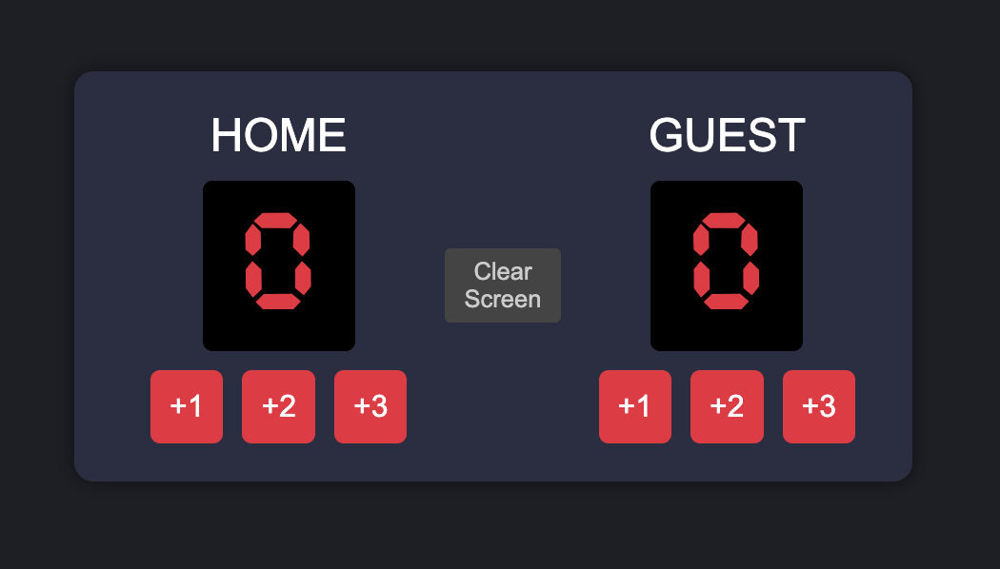

# Basketball Scoreboard

---

### Basketball Scoreboard

1. Keep score between HOME and GUEST teams
2. Keep score and add points
   - Add 1 point
   - Add 2 points
   - Add 3 points
3. More to come

### Figma design [scoreboard](https://www.figma.com/design/xEJ9d7nzumVgGseziSI4bp/Basketball-Scoreboard-(Copy)?node-id=0-1&t=T3jyZgfcWqcI2G0X-1)

[Live Demo](https://basketball-scoreboard-smoky.vercel.app/)
